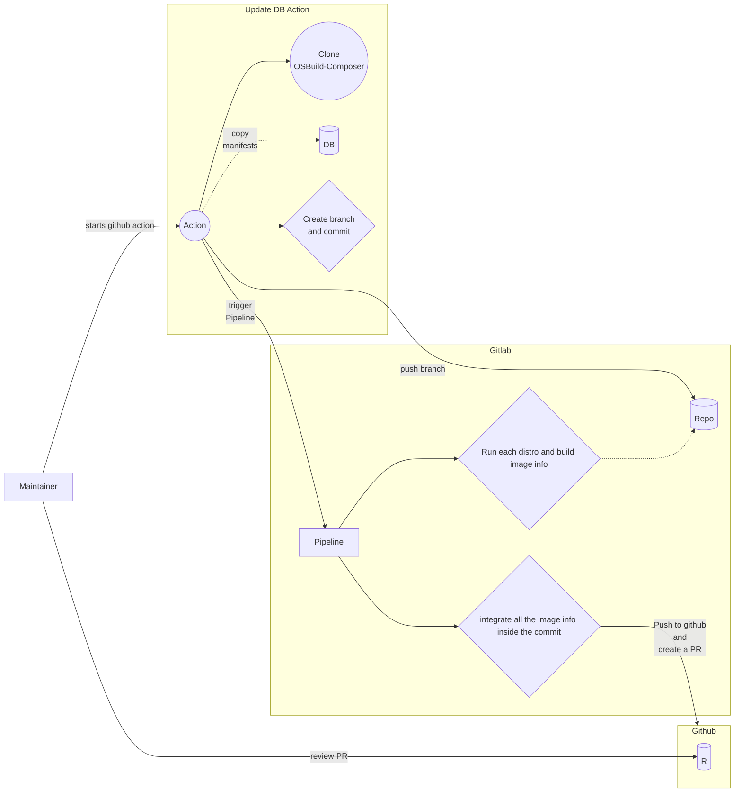

Manifest-db
=======

Stores all the manifests and corresponding image-infos to test OSbuild.

### Update workflow

The update workflow is made of 3 distinct steps:

#### First step, triggering the CI

The update workflow starts with an `Update DB` GitHub action that is manually
triggered. This action imports a subset of the manifests from osbuild-composer,
specifically those CI is able to build.

Importing manifests which cannot be built by CI will leave the
DB in a dirty state. For this reason they are excluded.

Once the import is done, a commit is created and pushed to [this GitLab repository](https://gitlab.com/redhat/services/products/image-builder/ci/manifest-db).

#### Second step, running the CI

Using a GitLab `trigger token` the GitHub action starts the CI with a
different workflow than the one used to run the regression testing.

A job for each architecture and distribution listed in
[.gitlab-ci.yml](https://github.com/osbuild/manifest-db/blob/main/.gitlab-ci.yml)
will run in parallel. Each job will generate and include the image-info for the
manifests where possible and expose them as artifacts. As a final step, a
conclusion job downloads every artifact and includes it in the commit that
initially triggered the CI job.

#### Third step, opening a PR on GitHub

Finally the commit is pushed to GitHub by Schutzbot and a PR is opened.

#### Resuming in a diagram

### Contributing

Please refer to the [developer guide](https://www.osbuild.org/guides/developer-guide/developer-guide.html) to learn about our workflow, code style and more.

### License:

 - **Apache-2.0**
 - See LICENSE file for details.
