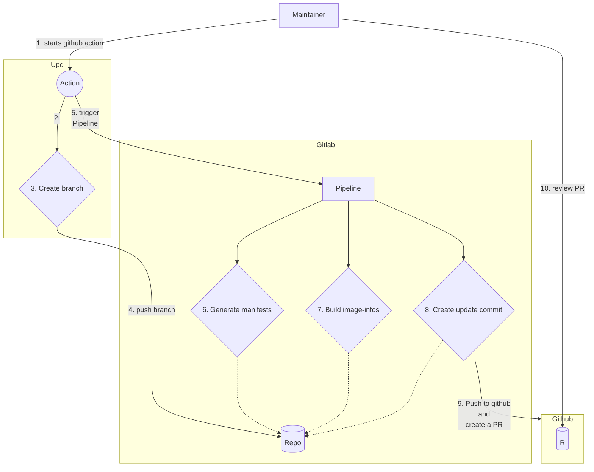

Manifest-db
=======

Stores all the manifests and corresponding image-infos to test OSbuild.

### Update workflow

#### 1/ on GitHub: trigger the Gitlab CI

The update workflow creates a branch that is pushed to [this GitLab
repository](https://gitlab.com/redhat/services/products/image-builder/ci/manifest-db).
Using a GitLab `trigger token` the GitHub action starts the CI with a
different workflow than the one used to run the regression testing.

#### 2/ on CI: Manifest generation

A job synchronise with the latest composer version and run the `gen-manifests`
command` with 50 workers and stores the generated manifests as an artifact.

#### 3/ on CI: Image-info builds

A job for each architecture and distribution listed in
[.gitlab-ci.yml](https://github.com/osbuild/manifest-db/blob/main/.gitlab-ci.yml)
will run in parallel. Each job will:

- import the generated manifests
- generate and include the image-info for the manifests where possible and
  expose them as artifacts.

#### 4/ on CI: PR creation

A final job imports the generated manifests and image-info, updates the DB with
these information, creates a commit, pushes it on Github and finally opens a PR
using the [Schutzbot](https://github.com/schutzbot) user.

The PR message contains a check list of changed manifests and image-info. The
list is generated with the command `tool/update_tool report --github-markdown`

#### Resuming in a diagram

### Contributing

Please refer to the [developer guide](https://www.osbuild.org/guides/developer-guide/developer-guide.html) to learn about our workflow, code style and more.

### License:

 - **Apache-2.0**
 - See LICENSE file for details.
